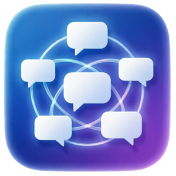

  

<h1 align="center">Silver Maria Stream</h1>

  Единый чат, реакции, озвучка и AI-инструменты для стримов на Twitch, YouTube, VK Видео Live и Kick.

  
  
  

  <a href="https://github.com/DeSjeT/SilverMariaStream-Releases/releases/latest"><b>Скачать последнюю версию</b></a>
  ·
  <a href="TESTER_GUIDE.md">Инструкция для тестеров</a>

Silver Maria Stream собирает чаты нескольких стриминговых платформ в одном окне и помогает превратить сообщения зрителей в часть трансляции. Программа выводит чат в OBS, запускает медиа-реакции, озвучивает сообщения и подключает AI для юмористических мутаций, комментариев компаньона и анализа чата.

## Что умеет программа

- **Объединять чаты:** Twitch, YouTube, VK Видео Live и Kick отображаются в общей ленте с аватарами, ролями и значками платформ.
- **Работать с OBS:** готовые локальные адреса для док-панели, чата на сцене, реакций и AI-уведомлений без привязки к папке установки.
- **Запускать реакции зрителей:** изображения, GIF, видео, звук и подписи по команде, ключевому слову, первому сообщению или таймеру.
- **Озвучивать сообщения:** онлайн-голоса, системная озвучка Windows и необязательный локальный Piper с fallback при сетевой ошибке.
- **Менять сообщения через AI:** мутация сохраняет исходный смысл, но переписывает фразу в выбранном стиле и при необходимости озвучивает результат.
- **Добавлять AI-компаньона:** отдельный персонаж анализирует общий разговор и периодически комментирует происходящее в чате.
- **Анализировать эфир:** сводка последних сообщений, поиск вопросов зрителей, история посещений и текущая активность чата.
- **Выбирать AI-провайдера:** OpenRouter, Ollama Cloud или локальная Ollama; для мутации и компаньона можно использовать разные модели.

## Быстрый старт

1. Скачайте ZIP-архив со страницы [Releases](https://github.com/DeSjeT/SilverMariaStream-Releases/releases/latest).
2. Полностью распакуйте архив в отдельную папку.
3. Запустите `Silver Maria Stream.exe` и пройдите мастер первоначальной настройки.
4. Подключите нужные платформы либо продолжите в демонстрационном режиме.
5. На шаге OBS скопируйте готовые адреса для док-панели и Browser Source.
6. При необходимости выберите AI-провайдера, загрузите список моделей, выберите модель и выполните быструю проверку.

Подробное описание каждой страницы находится в [инструкции для тестеров](TESTER_GUIDE.md).

## Подключение к OBS

Программа запускает локальные виджеты на `127.0.0.1`. Они доступны только на вашем компьютере и не публикуются в интернет.

- **Док-панель** — общий чат внутри интерфейса OBS.
- **Чат на сцене** — отдельный Browser Source с настраиваемым оформлением.
- **Реакции и AI** — полноэкранный прозрачный Browser Source для видео, звука, подписей, мутаций и комментариев компаньона.

Для источника реакций укажите разрешение сцены, например `1920 × 1080`, и включите **«Управление аудио через OBS»**.

## AI без привязки к одному сервису

Silver Maria Stream поддерживает:

- **OpenRouter** — облачные модели, включая доступные бесплатные варианты;
- **Ollama Cloud** — модели облачного сервиса Ollama;
- **локальную Ollama** — работа с загруженными моделями на компьютере пользователя.

AI является необязательным. Чаты, OBS-виджеты, реакции и обычная озвучка работают без него.

## Системные требования

- Windows 10 или Windows 11;
- OBS Studio для вывода виджетов на трансляцию;
- интернет для подключения платформ и облачных функций;
- Ollama устанавливается отдельно только для локальных моделей;
- Piper устанавливается из программы отдельно и не входит в основной архив.

## Статус проекта

Silver Maria Stream находится в открытом beta-тестировании. Возможны ошибки отдельных платформ после изменений их API. Перед обновлением программа проверяет актуальность beta-версии, а пользовательские настройки и реакции хранит в `%APPDATA%\Silver Maria Stream`.

При ошибке приложите описание действий, скриншот и последние строки вкладки `Логи`. При аварийном закрытии также пригодятся `crash_log.txt`, `native_crash_log.txt` и `startup_log.txt` из папки данных программы.

## Безопасность

Не публикуйте API-ключи, OAuth-файлы и содержимое пользовательской папки программы. Загружайте сборки только из раздела [Releases](https://github.com/DeSjeT/SilverMariaStream-Releases/releases).

